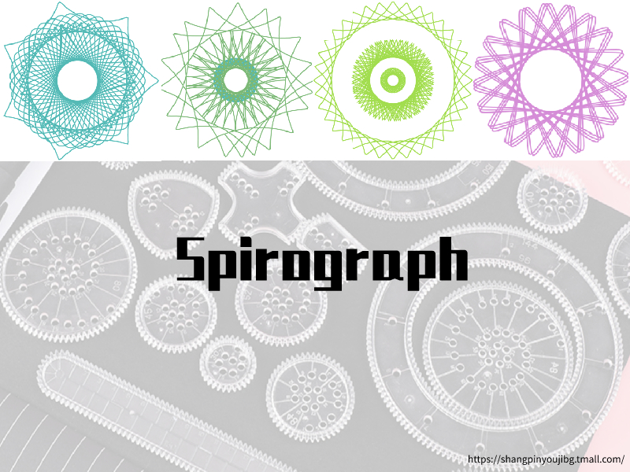
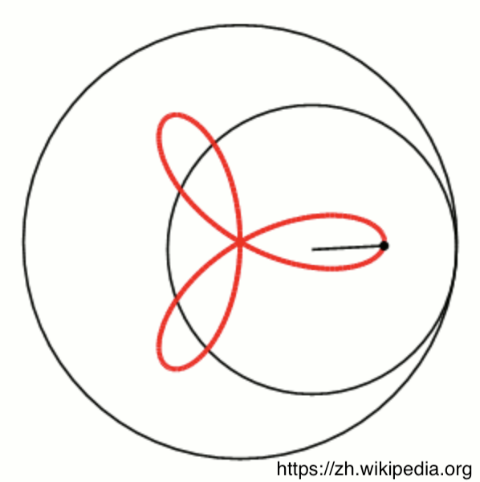
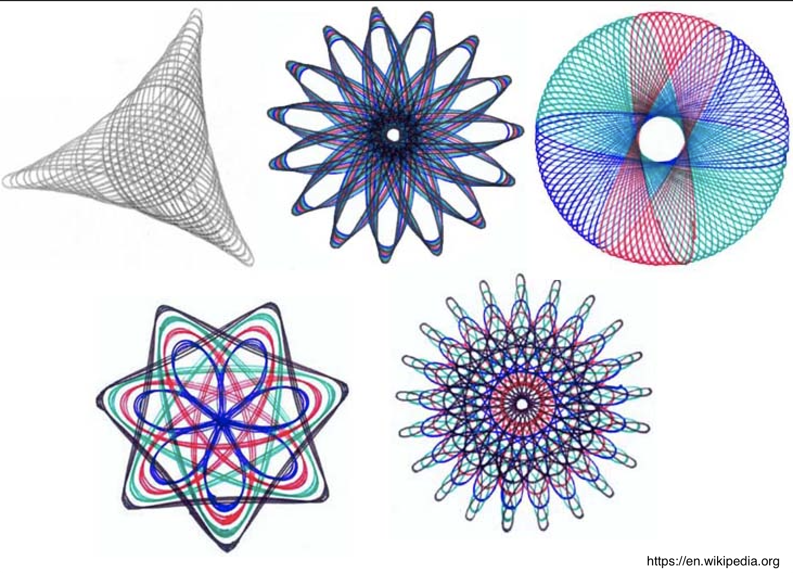

# Spirograph

## Introduce

The Spirograph is a drawing toy, composed of two parts: an external drawing board and an internal circular drawing board. The inner circle board is like a gear, with many pen holes at different radius along the center of the circle. The outer board is a large circular hole similar to the inner gear. The inner circular board is placed in the circular hole of the outer drawing board and rotates along the circumference. A regular pattern like a flower can be drawn from the pen hole with a pencil.

Visit Wikipedia for more information: [Spirograph](https://en.wikipedia.org/wiki/Spirograph).

This Playground will simulate the drawing process of the Spirograph.